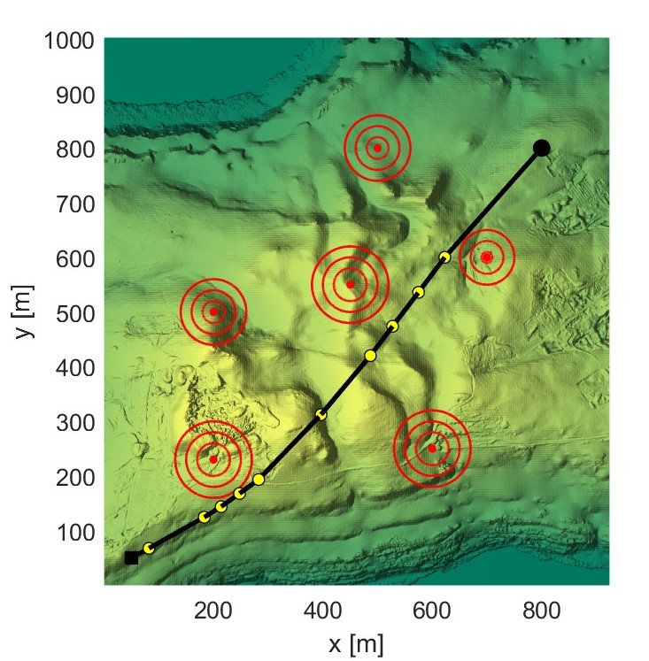

This is the source code for the algorithm **Navigation Variable-based Multi-objective Particle Swarm Optimization (NMOPSO) algorithm**. The current implementation is for path planning of Unmanned Aerial Vehicles (UAV). 
However, it can be modified to apply to other optimization problems.

To run the program, download all the source files and run "NMOPSOmain.m" in MATLAB.

