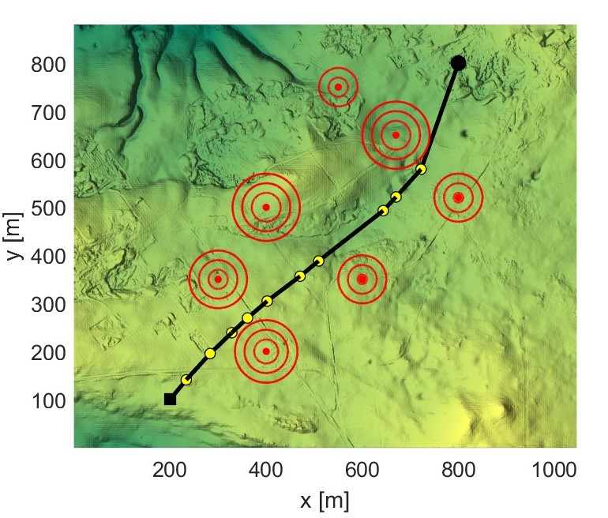
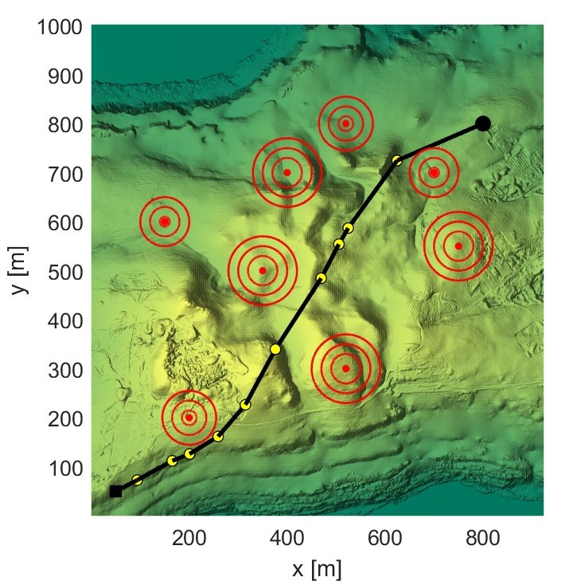

# NMOPSO Algorithm Source Code

## Overview

This repository contains the source code for the **Navigation Variable-based Multi-objective Particle Swarm Optimization (NMOPSO) algorithm**. The current implementation is designed for path planning of Unmanned Aerial Vehicles (UAVs). However, with modifications, it can be applied to other optimization problems.

The algorithm is described in detail in the paper:
- **Duong, T.T.N., Bui, DN. & Phung, M.D. Navigation variable-based multi-objective particle swarm optimization for UAV path planning with kinematic constraints. Neural Comput & Applic (2025). [https://doi.org/10.1007/s00521-024-10945-1](https://doi.org/10.1007/s00521-024-10945-1)**

## Running the Code

To run the NMOPSO algorithm:

1. Download all the source files from this repository.
2. Open MATLAB.
3. Execute the main script by running `NMOPSO.m`.

## Visualization

Below are visualizations of the NMOPSO algorithm in action for different scenarios:

|  |  |
|:---:|:---:|

<!-- ## Citation

If you use this code, please cite the following paper:

```plaintext
@article{Duong2024NMOPSO,
  title={Navigation Variable-based Multi-objective Particle Swarm Optimization for UAV Path Planning with Kinematic Constraints},
  author={T.N. Duong, D.-N. Bui, M.D. Phung},
  journal={},
  year={2024},
  volume={},
  pages={}
} -->

